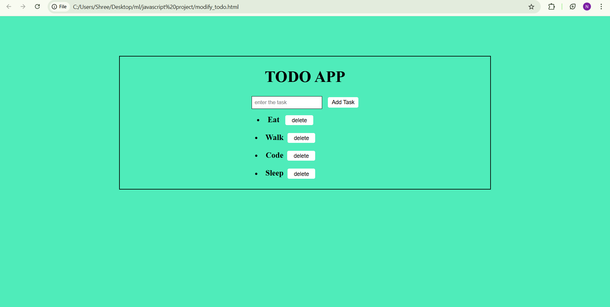

# 📝 Todo List Application

A simple and responsive **Todo List Web Application** built using **HTML, CSS, and JavaScript**.  
This application allows users to manage daily tasks efficiently by adding and deleting tasks through a clean and intuitive interface.

---

## ✨ Features

- Add new tasks dynamically  
- Delete tasks with a single click  
- Tasks displayed in a centered, single-column layout  
- Clean and minimal user interface  

---

## 🛠️ Technology Stack

- **HTML5** – Semantic structure  
- **CSS3** – Styling, layout, and alignment  
- **JavaScript (ES6)** – DOM manipulation and event handling  

---
## 📸 Screenshots

---

## 🎯 Project Objective

The objective of this project is to strengthen understanding of:
- JavaScript DOM manipulation  
- Event-driven programming  
- CSS layout and alignment techniques  

---

## 📌 Use Case

This project is suitable for:
- Beginner to intermediate front-end developers  
- College mini-projects  
- Showcasing basic JavaScript skills on GitHub  

---

